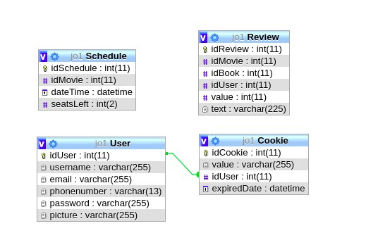
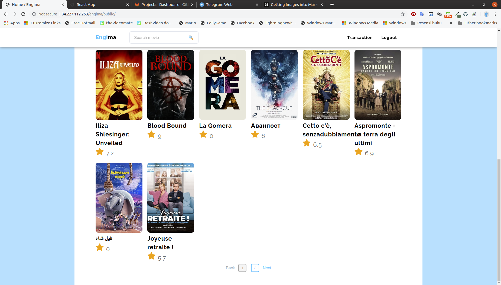
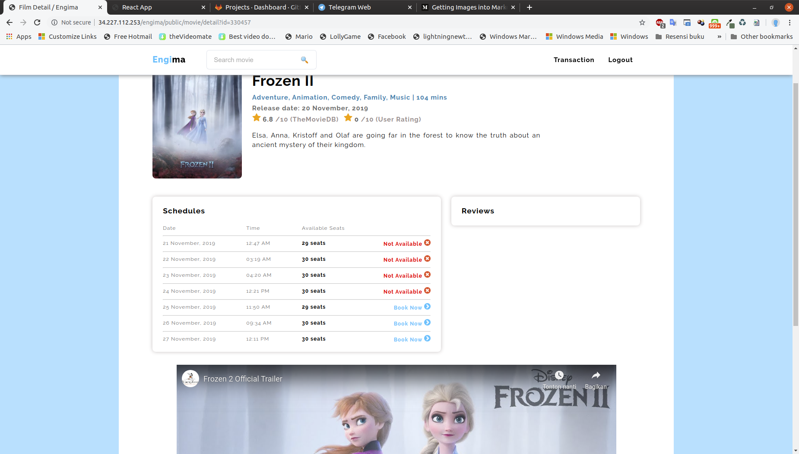
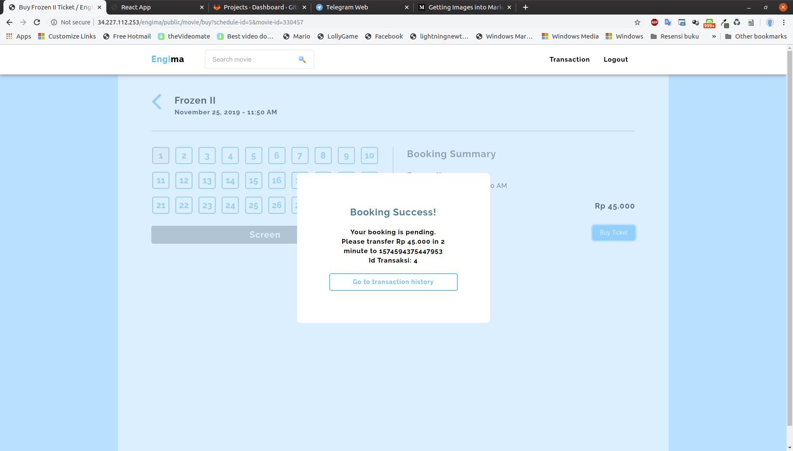
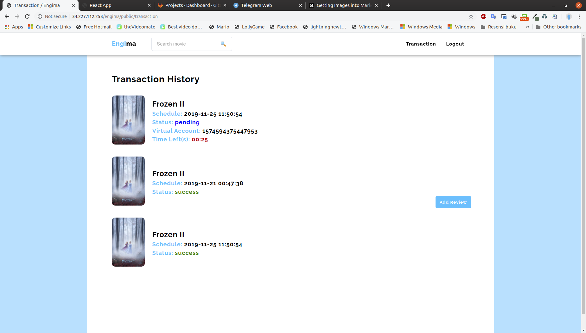

# Tugas 2 IF3110 Pengembangan Aplikasi Berbasis Web

## Deskripsi Aplikasi

Saat ini Engi ingin melakukan ekspansi usaha dengan membangun sebuah bioskop. Setelah berdiri selama 2 bulan, Engi merasa bioskopnya sepi dibanding bioskop kompetitor lainnya. Usut punya usut, ternyata faktor utama penyebab sepinya bioskop Engi adalah tidak adanya kemudahan pemesanan tiket secara daring. Oleh karena itu, Engi meminta Anda untuk membuat aplikasi web pemesanan tiket bioskop daring. Engi menginginkan website miliknya untuk memiliki fitur pembelian tiket, memberi ulasan pada film yang telah ditonton, login dan register, riwayat pembelian tiket.

Engi telah mempekerjakan seorang UI/UX profesional untuk mendesain tampilan *website*-nya. Anda diminta untuk mengimplementasikan tampilan sedemikian mirip dengan tampilan pada contoh. Engi tidak meminta Anda untuk membangun *website* yang *responsive*. Icon dan jenis font tidak harus sama dengan contoh. Tata letak elemen, warna font, garis pemisah, dan perbedaan ukuran font harus terlihat sesuai contoh. Format rating dan waktu harus terlihat sesuai contoh tampilan.

Setelah aplikasi web Engima diluncurkan, bioskop Engi menjadi sangat laku. Sebelumnya, Engi
mengurus semua transaksi tiket film dan penambahan data film secara manual. Karena
kewalahan, akhirnya Engi pergi ke seorang konsultan IT untuk menemukan solusi dari
permasalahannya. Konsultan menyarankan Engi untuk menggunakan ​ web service untuk
mempermudah pekerjaannya. Melihat aplikasi web yang Anda kerjakan memuaskan, Engi
meminta Anda untuk mengimplementasikan perubahan tersebut beserta ​ web service dan
aplikasi Bank yang digunakan untuk transaksi tiket film di Engima.

## Schema Basis Data Engima

## ScreenShot

Home mengambil dari TMDB tambah pagination
  

Halaman detail mengambil dari TMDB tambah trailer film jika ada 
Review yang ditampilkan ada 2 yaitu dari TMDB dan dari review pengguna Engima
  

Modal detail ditambahkan virtual account dan id transaksi
  

Halaman transaksi menampilkan status transaksi, jika masih pending akan ditampilkan waktu countdown dan virtual accountnya 
Perubahan halaman dilakukan secara realtime
  

## Pembagian Tugas

### REST
| No | Tugas         | NIM      |
| ---|---------------|---------:|
| 1  | TheMovieDB | 13517012 |
| 2  | Transaksi Fungsi tambah transaksi | 13517012 |
| 3  | Transaksi Fungsi mengubah status transaksi | 13517126 |
| 4  | Transaksi Fungsi mengambil data transaksi user | 13517069 |

### SOAP
| No | Tugas         | NIM      |
| ---|---------------|---------:|
| 1  | Bank Fungsi validasi nomor rekening | 13517012 |
| 2  | Bank Fungsi mengambil data rekening nasabah | 13517069 |
| 3  | Bank Fungsi melakukan transfer | 13517069 |
| 4  | Bank Fungsi membuat akun virtual | 13517126 |
| 5  | Bank Fungsi mengecek keberadaan suatu transaksi kredit | 13517069 |

### React.js
| No | Tugas         | NIM      |
| ---|---------------|---------:|
| 1  | Login | 13517126 |
| 2  | Halaman utama | 13517012 |
| 3  | Halaman transfer | 13517069 |
| 4  | Halaman riwayat transaksi | 13517126 |

### Perubahan Engima
| No | Tugas         | NIM      |
| ---|---------------|---------:|
| 1  | Halaman Transaction History | 13517126 |
| 2  | Halaman Film Details | 13517069 |
| 3  | Halaman Buy | 13517012 |
| 4  | Halaman Home | 13517012 |
| 5  | Halaman Search | 13517012 |

### Pembagian tugas setiap anggota
|**No**|**Tugas**|**NIM**|
|-|-|-|
|1|Code reviewer (PIC)|[13517012](#johanes)|
|2|CI/CD|[13517012](#johanes)|
|3|Eksplorasi dan *setup* mesin deployment|[13517012](#johanes)|